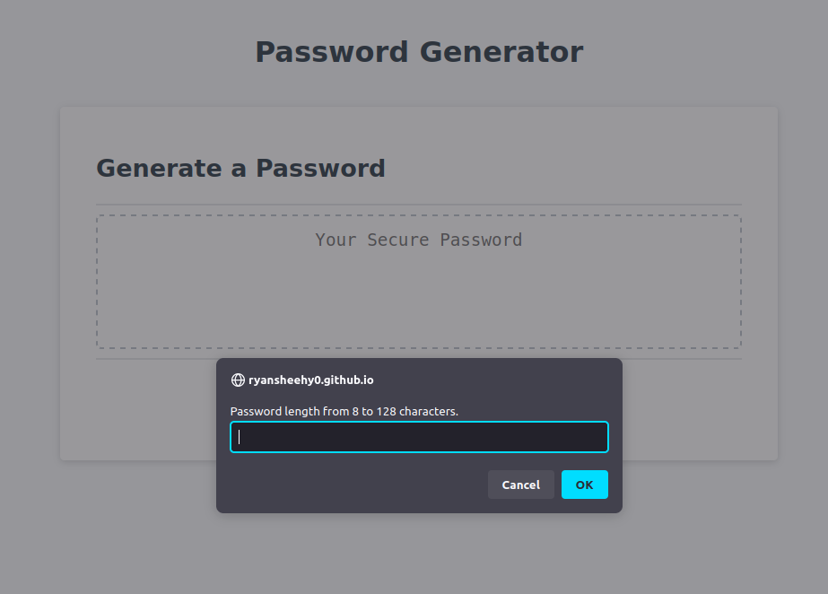
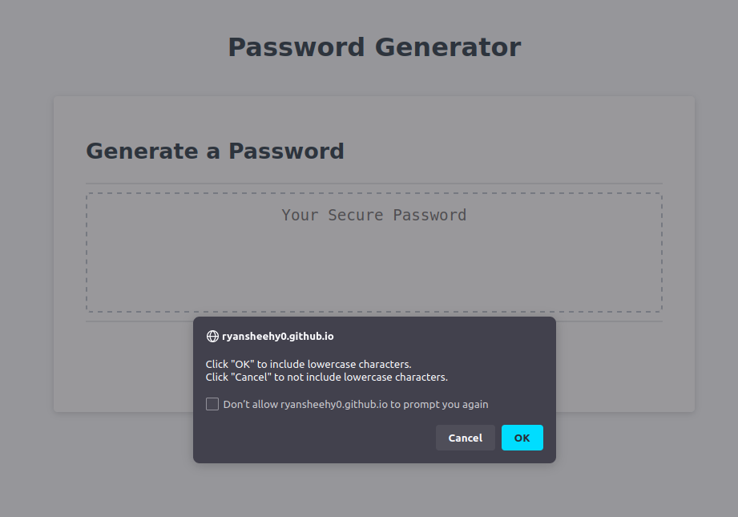

# Password Generator

## Description
A website that allows a user to generate a random password from 8 to 128 characters.

## Usage
Just click generate password and follow the prompts. First, specify the length of the password. Second, press OK to allow that character type to be in the password. The random password will show in the dotted lines.

You can check out the website though this [link](https://ryansheehy0.github.io/Module_3_Challenge/).

## Source Code
This source code can be found within the folder docs.
